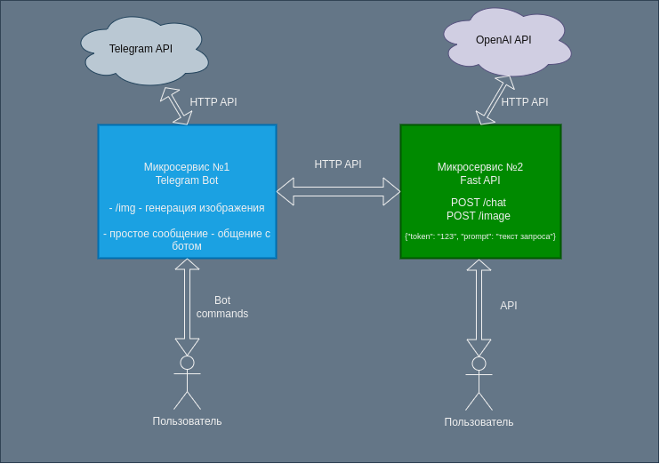
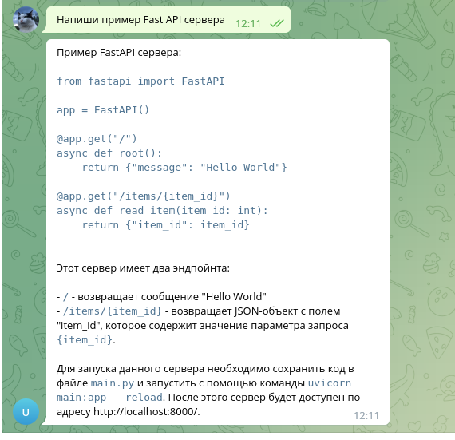
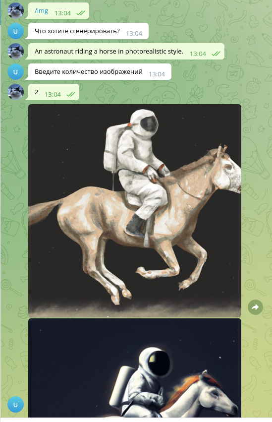

# Итоговой проект по программной инженерии: Телеграм бот + Fast API + OpenAI API


Проект состоит из двух микросервисов: телеграм бота и Fast API сервера.

Ссылка на проект: http://83.220.171.48:8080/docs 

Ссылка на телеграм бот: https://t.me/urfus_bot

### Оглавление
#### Оглавление
- [Цель проекта](#цель-проекта)
- [Описание проекта](#описание-проекта)
- [Настройка окружения](#настройка-окружения)
- [Запуск проекта](#запуск-проекта)
- [Запуск тестов](#запуск-тестов)
- [Работа с проектом](#работа-с-проектом)
- [Пример как работает программа](#пример-как-работает-программа)
- [Issues](#issues)
- [Глоссарий](#глоссарий)
- [Ссылки](#ссылки)
- [Авторы проекта](#авторы-проекта)


### Цель проекта

Разработать Web или API приложение машинного обучения и развернуть его в облаке.

### Описание проекта

Схема микросервисов:




Команды бота и эндпоинты API сервера:

Команды бота:
```commandline
/img - генерация изображения

любое сообщение - общение с ботом
```

Эндпоинты API сервера:

```commandline
POST /chat
curl -X POST -H "Content-Type: application/json" -d '{"token": "123", "prompt": "Напиши пример fast api сервера"}' http://83.220.171.48:8080/chat

POST /image
curl -X POST -H "Content-Type: application/json" -d '{"token": "123", "prompt": "Бобер в беретке"}' http://83.220.171.48:8080/image
```

### Настройка окружения
#### Требование к оркужению
- Интерпретатор Python не ниже 3.8
- подключение к интернету
- OS Ubuntu 20+ или Windows(IDE: PyCharm)
- Docker и docker-compose


Склонируйте репозиторий:
```commandline
git clone https://github.com/vadim328/ChatGPT3.5-Turbo.git
```

Перейдите в директорию проекта:
```commandline
cd ChatGPT3.5-Turbo
```

#### Настройка окружения телеграм бота

В директории `/bot` создать файл `.env` (для примера есть файл `/bot/.env.example`).

В файле `.env` прописать следующие переменные окружения:

```
BOT_TOKEN=12345:AbcdeqwertY
FASTAPI_ACCESS_TOKEN='123'
SERVER_URL='http://server:8080'
```
`BOT_TOKEN` - Создайте бота и получите токен от [@BotFather](https://t.me/BotFather)

`FASTAPI_ACCESS_TOKEN` - токен для доступа в Fast API сервер

`SERVER_URL` - адрес Fast API сервера. При запуске через docker-compose, адрес `http://server:8080`, или `http://127.0.0.1:8000` при запуске без докера.


#### Настройка окружения Fast API сервера

В директории `/server` создать файл `.env` (для примера есть файл `/server/.env.example`).

В файле `.env` прописать следующие переменные окружения:

```
OPENAI_ACCESS_TOKEN="my token"
OPENAI_COMPLETIONS_URL="https://api.openai.com/v1/chat/completions"
OPENAI_IMAGE_URL="https://api.openai.com/v1/images/generations"
OPENAI_TRANSLATE_URL="https://api.openai.com/v1/completions"
OPENAI_GPT_MODEL="gpt-3.5-turbo"

FASTAPI_ACCESS_TOKEN='123'
```
`OPENAI_ACCESS_TOKEN` - необходимо получить в [OpenAI.com](http://openai.com)

`FASTAPI_ACCESS_TOKEN` - токен для доступа в Fast API сервер, должен быть таким же как в телеграм боте.

`OPENAI_GPT_MODEL` - модель openai

`OPENAI_COMPLETIONS_URL` - адрес API openai для генерации общения

`OPENAI_IMAGE_URL` - адрес API openai для генерации изображений

`OPENAI_TRANSLATE_URL` - адрес API openai для перевода текста на английский. Задействован внутри сервиса как посредник между пользовательским запросом и генератором изображений, так как генератор изображений не совсем понимает русский язык.


### Запуск проекта

#### Запуск телеграм бота
Перейти в папку микросервиса `/bot`

Создать виртуальное окружение python и активировать: 
```commandline
python -m venv botenv

source botenv/bin/activate
```

Установите зависимости:
```commandline
pip install -r requirements.txt
```

Запустить бота:

```commandline
python bot.py
```

#### Запуск Fast API сервера
Перейти в папку микросервиса `/server`

Создать виртуальное окружение python и активировать: 
```commandline
python -m venv serverenv

source serverenv/bin/activate
```

Установите зависимости:
```commandline
pip install -r requirements.txt
```

Запускаем проект командой
```bash
uvicorn app:app
```

Приложение будет доступно на порту 8000.

### Запуск проекта в докер контейнере
Для удобства развертывания добавили Dockerfile для каждого микросервиса.

Можно запустить таким образом (примерчание: при запуске проекта в докер-контейнере отдельная установка зависимостей из requirements.txt не требуется):

```bash
docker-compose build

docker-compose up -d
```

Приложение FAST API будет доступно на порту 8080.
Телеграм бот - по адресу бота.

### Запуск тестов

Запуск тестов производится с помощью команды pytest в каталогах с микросервисами.

```
pytest
```

### Работа с проектом
1. Открываем в браузере адрес:
```
http://83.220.171.48:8080/docs 
```

В методы `POST /chat` и `POST /image` отправляем запросы в формате JSON:

```json
{"token":  "123", "prompt":  "текст вопроса"}
```

`POST /chat` - принимает вопросы и отвечает

`POST /image` - необходимо отправить запрос на генерацию изображения, например, "Бобер в беретке" вернет такой результат:


Ответ возвращается в виде json со ссылкой на сгенерированное изображение.

_При разворачивании проекта на локальном ПК, fast api сервер обычно доступен по адресу http://127.0.0.1:8000_

#### Пример как работает программа

Пример ответа бота:




Пример генерации изображения:




### Issues
Мы используем GitHub issues для отслеживания ошибок. Пожалуйста, убедитесь, что ваше описание понятно и содержит достаточные инструкции для воспроизведения проблемы.

### Глоссарий
- OpenAI - исследовательско-разработческая компания, которая занимается разработкой искусственного интеллекта. Разработчик ChatGPT 3, 4 итд.
- Telebot - библиотека Python для создания Telegram ботов. Она предоставляет простой и удобный интерфейс для взаимодействия с Telegram API и создания функциональных ботов.
- Fast API - современный веб-фреймворк для создания REST API на Python. Он основан на стандарте OpenAPI и использует типизацию данных и асинхронное программирование, что делает его быстрым, эффективным и простым в использовании.

### Ссылки
- [FastAPI](https://fastapi.tiangolo.com/)
- [Telebot](https://github.com/eternnoir/pyTelegramBotAPI)
- [Telegram API](https://core.telegram.org/)
- [OpenAI API reference](https://platform.openai.com/docs/api-reference)
- [OpenAI Documentation](https://platform.openai.com/docs/introduction)


### Авторы проекта
- [Искужин И.Р.](https://github.com/Lemeri02)
- [Ахметов Вадим М.](https://github.com/vadim328)
- [Акинин Дмитрий В.](https://github.com/AkininD)

студенты 1 курса магистратуры "Инженерия машинного обучения" УрФУ.

Июнь, 2023 год.
